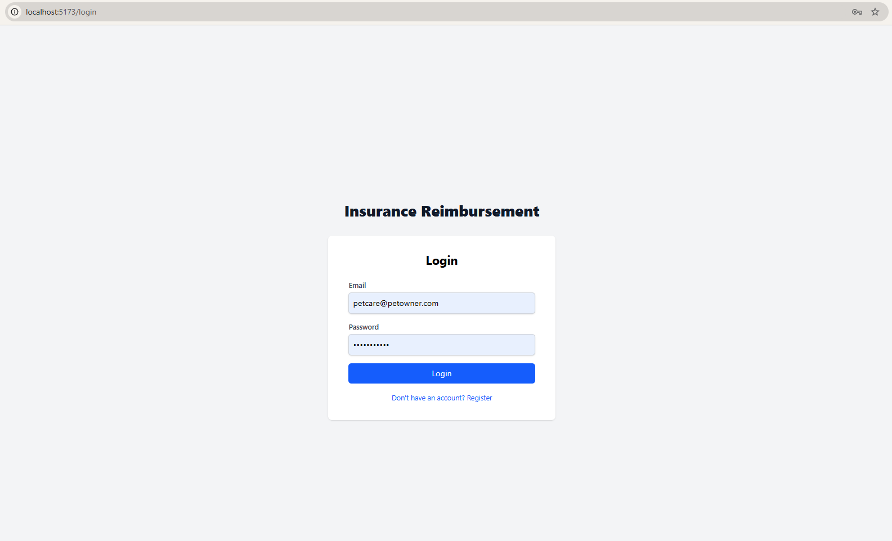
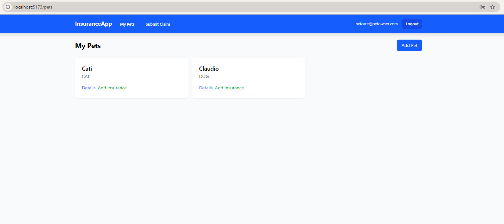
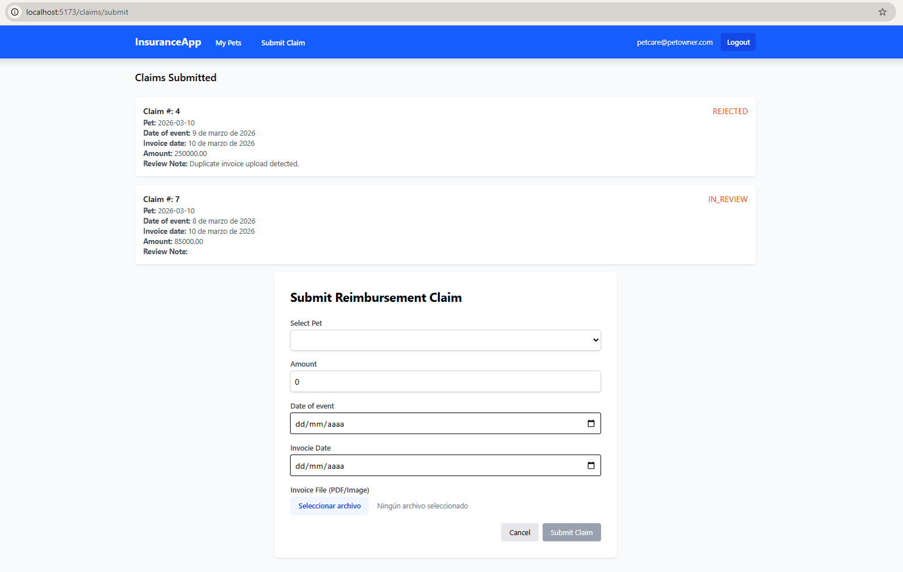

# Pet Insurance Reimbursement Platform

## Architecture Overview

### Backend
A Django-based platform for managing pet insurance claims with automated validation and role-based access control.

#### Architecture: Service-Repository-Selector
This project adheres to Clean Architecture principles using the following layers:
- **Models**: Standard Django ORM models defining the data schema.
- **Repositories**: Encapsulate all ORM logic. This decouples the domain logic from the persistence layer, making it easier to swap or mock data sources.
- **Services**: House the business logic and state transitions. Services are the primary way to perform "write" operations (mutations).
- **Selectors**: Centralize optimized "read" queries. Selectors ensure that complex data retrieval is consistent and doesn't clutter views or models.

#### Justification for Repository Pattern
- **Testability**: Allows for high-quality unit testing of business logic by mocking the Repository layer without needing a database.
- **Scalability**: Facilitates horizontal scalability by providing a clear boundary for data access, allowing for future optimizations like caching or polyglot persistence without changing the core business logic.
- **Maintainability**: Prevents the "Fat Model" and "Fat View" anti-patterns, keeping the codebase organized as the system grows.

### Frontend

This project follows a **Modular Layered Architecture**, optimized for scalability and maintainability using Vue 3 and TypeScript.

#### Design Patterns & Principles
- **Separation of Concerns (SoC):** The application logic is strictly decoupled into distinct layers:
  - **Services Layer:** Handles API communications and data fetching, acting as the infrastructure layer.
  - **State Management (Store):** Utilizes Pinia to maintain a single source of truth for the application state, ensuring reactivity across the UI.
  - **Presentation Layer:** Organized into `components` and `pages`, keeping the UI logic clean and declarative.
  - **Domain Types:** to enforce strict TypeScript interfaces across the entire data flow.
- **Composition API:** Leverages Vue 3's Composition API for better code reusability and logical grouping of features.

This architecture ensures that the codebase remains clean, testable, and easy to navigate as the application grows.

## Setup & Development

### 1. Prerequisite: Docker
Ensure Docker and Docker Compose are installed.

### 2. Launch Services
Run the following from the repository root:
```bash
docker-compose up --build
```
This will start:
- **Backend**: Django (Port 8000)
- **Database**: PostgreSQL
- **Worker**: Celery (handles file invoice validation)
- **Broker**: Redis
- **Frontend**: Vue 3 (Port 5173)

### 3. Initialize Database
Apply migrations and create a superuser:
```bash
docker-compose exec backend python manage.py migrate
docker-compose exec backend python manage.py createsuperuser
```

### 4. Testing
Run the test suite with coverage:
```bash
docker compose exec backend pytest
```

## API Documentation
Once the server is running, visit:
- **Swagger**: `http://localhost:8000/api/docs/`


## Access
- **Django Admin**: `http://localhost:8000/admin/`
- **Frontend**: `http://localhost:5173/`

## Workflow Simulation

### Frontend

1. **Login**: Authenticate as a CUSTOMER.
2. **Register**: Sign up a new customer.
3. **Register Pet**: Once the user access via login they can register a new pet.
4. **Register Insurance**: The user can register an insurance policy linked to their owned pet.
5. **Submit Claim**: Once the users register a pet and an insurance for the pet, they can submit a claim for the insurance.
6. **Validation**:
    - Invoice files size to upload must be less than 1mb.
    - Observe status transition from `PROCESSING` to `IN_REVIEW` (Check Celery logs).
7. **Review**: Authenticate as a SUPPORT user and `PATCH` the claim to `APPROVED`.
8. **Admin**: I choose activate django admin panel (`/admin`) to authenticate as an ADMIN to promote roles or override claim statuses.

### Frontend Screenshots

<br>
<br>
<br>
